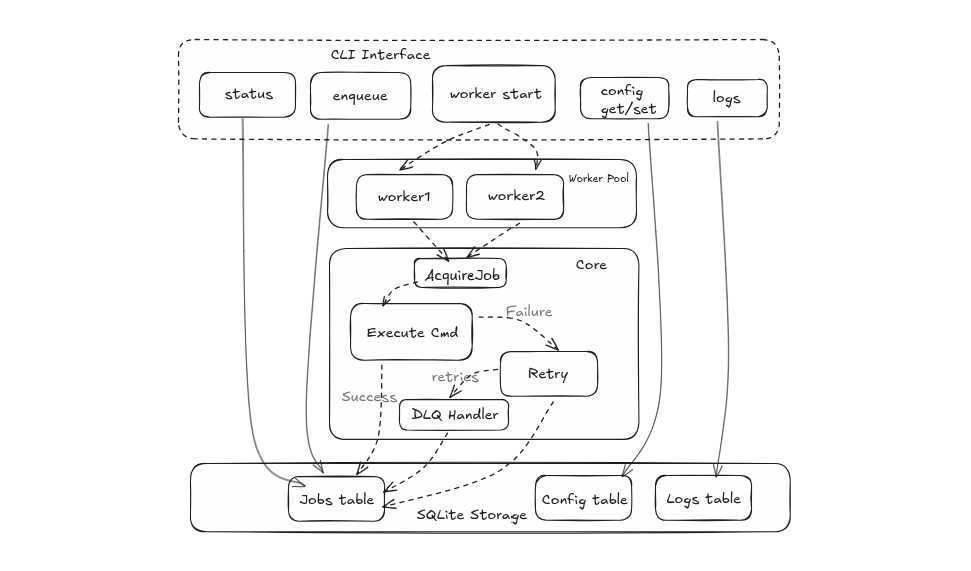

# QueueCTL — CLI-Based Background Job Queue System

QueueCTL is a lightweight, production-style background job queue written in Go.  
It provides persistent job storage, worker pools, automatic retries with exponential backoff, DLQ support, job logs, timeouts, lease recovery, and a clean CLI interface.

---

## Demo 
**[Demo Video Link](https://www.notion.so/QueueCTL-Demo-2aa2a35d981480c9a061d9cee4c3e520?source=copy_link)**
<!-- [Demo Video](assets/queuectl_demo) -->
---

## Architecture Diagram

The system architecture for QueueCTL is illustrated below:

<!-- **[Architecture Diagram]() -->


## Features

### Core Functionality
- Persistent job queue using SQLite  
- Worker pool with configurable concurrency  
- Exponential backoff retry mechanism  
- Dead Letter Queue (DLQ) for permanent failures  
- Graceful shutdown and lease-based recovery  
- Command execution via `sh -c`  
- Job output logging (stdout/stderr)  

### Additional Capabilities
- Job timeouts  
- Configurable retry/max-retry/backoff  
- Requeueing expired worker leases  
- Multi-worker concurrency without duplicate execution  
- Structured CLI with Cobra  

---

## Getting Started

### Prerequisites
- Go 1.21+  
- SQLite (optional, only if you want to manually inspect the DB)

### Installation

Build the binary:
```bash
go build -o queuectl .
```

(Optional) Install globally:
```bash
sudo mv queuectl /usr/local/bin/
```

---

## Usage

### Enqueue a job
```bash
queuectl enqueue "echo hello" --db ./queue.db
```

### Start workers
```bash
queuectl worker start --db ./queue.db
```

### List jobs
```bash
queuectl list --state pending --db ./queue.db
```

### Status summary
```bash
queuectl status --db ./queue.db
```

### View logs for a job
```bash
queuectl logs <job-id> --db ./queue.db
```

### Dead Letter Queue
```bash
queuectl dlq list --db ./queue.db
queuectl dlq retry <job-id> --db ./queue.db
```

### Configuration
```bash
queuectl config get --db ./queue.db
queuectl config set backoff_base 3 --db ./queue.db
```

---

## Project Structure

```
.
├── cmd/                # CLI commands (Cobra)
├── internal/
│   ├── core/           # Retry manager, worker logic
│   └── store/          # SQLite storage implementation
├── pkg/models/         # Job and config models
├── scripts/            # e2e and concurrency test scripts
└── queuectl (bin)
```

---

## Architecture Overview

QueueCTL is built around four primary components:

### 1. **CLI Layer**
Parses commands using Cobra and routes actions to storage or workers.

### 2. **Storage Layer (SQLite)**
Handles:
- Job persistence  
- Atomic `AcquireJob` via SQL transactions  
- Logs  
- Config values  
- DLQ transitions  

### 3. **Core Logic**
- Retry Manager (exponential backoff)  
- Worker loop  
- Timeout enforcement  
- Lease expiration reaper  
- DLQ handling  

### 4. **Worker Pool**
Multiple goroutines or processes polling the storage, executing commands, and updating job state safely.

---

## Testing

### E2E test
```bash
./scripts/e2e_test.sh
```

### Concurrency test
```bash
./scripts/concurrency_test.sh
```

### Manual database inspection:
```bash
sqlite3 demo.db "SELECT state, COUNT(*) FROM jobs GROUP BY state;"
```

---

## Design Choices

- SQLite chosen for simplicity and robustness  
- Workers rely on DB-level locking (serializable transactions)  
- Jobs are executed through the shell for portability  
- Backoff formula: `delay = base^attempt` with 5-minute cap  
- Lease timeout prevents stuck jobs when workers crash  

---

## Future Improvements

- Scheduled jobs (`run_at`)  
- Priority queues  
- HTTP API / dashboard  
- Job cancellation  
- Distributed store (Postgres / Redis)  

